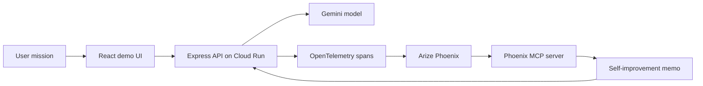

# TraceCoach Agent

TraceCoach is a Rapid Agent Builder Hackathon project for the Arize partner track.
It demonstrates an agent that does more than answer: it acts with Gemini, emits
Phoenix-compatible traces, evaluates its own run, and writes a targeted prompt
improvement memo from the observed spans.

Live demo: <https://tracecoach-agent-hskfubefuq-an.a.run.app>

## Why this can win

Most agent demos show a happy path. TraceCoach shows the loop a production team
actually needs:

1. Observe the complete agent run as spans.
2. Evaluate quality, tool efficiency, and actionability.
3. Use Phoenix MCP to inspect traces, prompts, datasets, and experiments.
4. Improve the next run with a specific prompt or workflow change.

That maps directly to the Arize track: tracing, MCP, and an agent that becomes
more reliable because it can inspect its own behavior.

## Demo

```bash
npm install
cp .env.example .env
npm run dev
```

Use Node.js 20.6 or newer. The Dockerfile uses the current Node 20 image.

Open <http://localhost:5173>. The default `Demo` mode runs without credentials
so judges can see the full loop immediately.

For live Gemini mode, set:

```bash
GOOGLE_API_KEY=your-google-api-key
GEMINI_MODEL=gemini-3-pro
```

Then switch the UI to `Gemini live`.

## Phoenix / Arize setup

TraceCoach exports OpenTelemetry spans when `OTEL_EXPORTER_OTLP_ENDPOINT` is set.
For Phoenix Cloud, use the Phoenix OTLP trace endpoint and API key:

```bash
OTEL_EXPORTER_OTLP_ENDPOINT=https://app.phoenix.arize.com/v1/traces
PHOENIX_API_KEY=your-phoenix-key
```

To connect an MCP-capable coding agent to the same Phoenix project, use the
official Phoenix MCP server:

```json
{
  "mcpServers": {
    "phoenix": {
      "command": "npx",
      "args": [
        "-y",
        "@arizeai/phoenix-mcp@latest",
        "--baseUrl",
        "https://app.phoenix.arize.com",
        "--apiKey",
        "your-phoenix-key"
      ]
    }
  }
}
```

Source: Arize documents `@arizeai/phoenix-mcp` as the Phoenix MCP server for
projects, traces, spans, sessions, prompts, datasets, and experiments:
<https://arize.com/docs/phoenix/integrations/phoenix-mcp-server>.

## Architecture



## Cloud Run deployment

```bash
gcloud run deploy tracecoach-agent \
  --source . \
  --region us-central1 \
  --allow-unauthenticated \
  --set-env-vars GEMINI_MODEL=gemini-3-pro \
  --set-secrets GOOGLE_API_KEY=GOOGLE_API_KEY:latest,PHOENIX_API_KEY=PHOENIX_API_KEY:latest
```

If you do not use Secret Manager yet, deploy with `--set-env-vars` while testing
and move secrets before submitting.

## Submission checklist

- Public GitHub repository with this README.
- Hosted URL from Cloud Run.
- Three-minute English demo video.
- Phoenix screenshot showing `agent.plan`, `agent.execute_tools`,
  `phoenix.evaluate_trace`, and `phoenix.mcp_self_introspection` spans.
- Devpost description focused on production agent reliability, not generic chat.

## Tech stack

- Gemini via `@google/genai`
- OpenTelemetry spans exported to Phoenix / Arize
- Phoenix MCP server for trace and prompt introspection workflows
- Express API, React UI, Vite build
